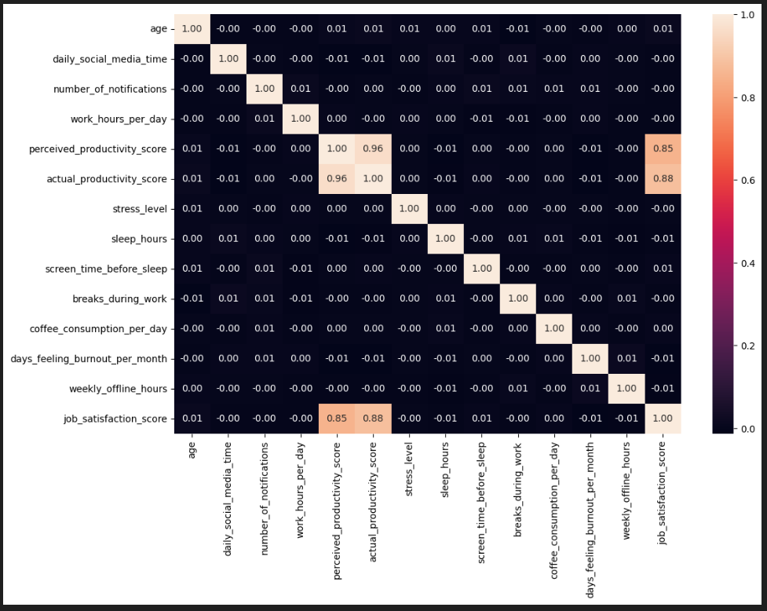
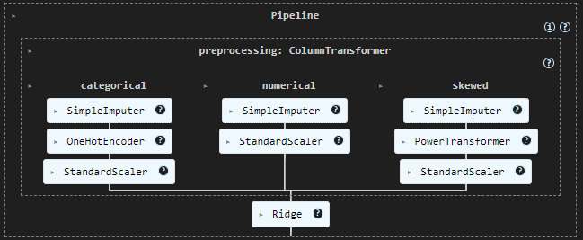
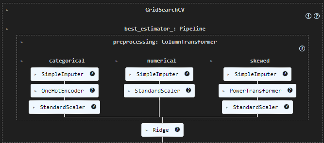
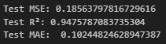
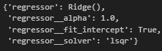

# Social Media vs Productivity — ML Pipeline

This project analyzes how various lifestyle and behavioral factors — including social media usage — impact actual productivity scores. It performs exploratory data analysis, builds preprocessing and regression pipelines, performs model tuning via Grid Search, and interprets results using SHAP.

## Project Structure

---

```bash
Social Media vs Productivity - ML Pipeline
|
│   analysis.ipynb
│   README.md
│
├─── /data
│       social_media_vs_productivity.csv
│
├─── /model
│       best_model.pkl
│
└─── /modular_code
        config.py
        eda.py
        explain.py
        main.py
        model.py
        preprocessing.py
```

---

## Features Used

From the original dataset, the following columns are selected and processed:

- **Numerical**: `age`, `daily_social_media_time`, `sleep_hours`, `coffee_consumption_per_day`, `weekly_offline_hours`, `days_feeling_burnout_per_month`, `perceived_productivity_score`, `productivity_diff`
- **Categorical**: `job_type`, `social_platform_preference`, `breaks_during_work`
- **Target**: `actual_productivity_score`



A new feature `productivity_diff` is later engineered as the difference between perceived and actual productivity.

---

## Workflow

### 1. Load and preprocess data
- Missing values are handled via `SimpleImputer`.
- Skewed data (e.g., social media time) is transformed using `PowerTransformer`.
- Categorical data is encoded with `OneHotEncoder`.
- All features are scaled via `StandardScaler`.

### 2. Exploratory Data Analysis (`eda.py`)
- Histograms of numeric columns
- Bar plots of categorical distributions
- Correlation heatmaps
- Box plots to understand categorical impacts on productivity

### 3. Model Pipeline (`model.py`)
- A `Pipeline` combines preprocessing and a regression model.
- Models compared: `Ridge`, `LinearRegression`
</img>


- `GridSearchCV` tunes hyperparameters like alpha, solver, etc.
</img>

### 4. Evaluation (`model.py`)
- Metrics reported: R², RMSE, MAE

### 5. Explainability (`explain.py`)
- SHAP values highlight the contribution of each feature to predictions
- Feature names are extracted dynamically from the transformed pipeline

---

## Requirements

### Installing dependencies:

```bash
pip install -r requirements.txt
```

---

## Running the project

```bash
python modular_code/main.py
```

The script will:
1) Read and preprocess the data
2) Train and tune the regression model
3) Evaluate performance
4) Save the best model to model/best_model.pkl
5) Generate SHAP interpretability plots

---

## Current Output

Results: 
</img>

Best parameters:
</img>

---

## Dataset

The dataset used sources from [Mahdimashayekhi's](https://www.kaggle.com/mahdimashayekhi) [Social Media v/s Productivity](https://www.kaggle.com/datasets/mahdimashayekhi/social-media-vs-productivity/data) Kaggle dataset website.

---

## Future improvements

- Enhanced feature engineering
- Adding more regressors
- Model drift tracking
- Visualization of cross-validation
- Creation and training of DNN using tensorflow
- Comparison of DNN models and ML models
- Web app hosting


---